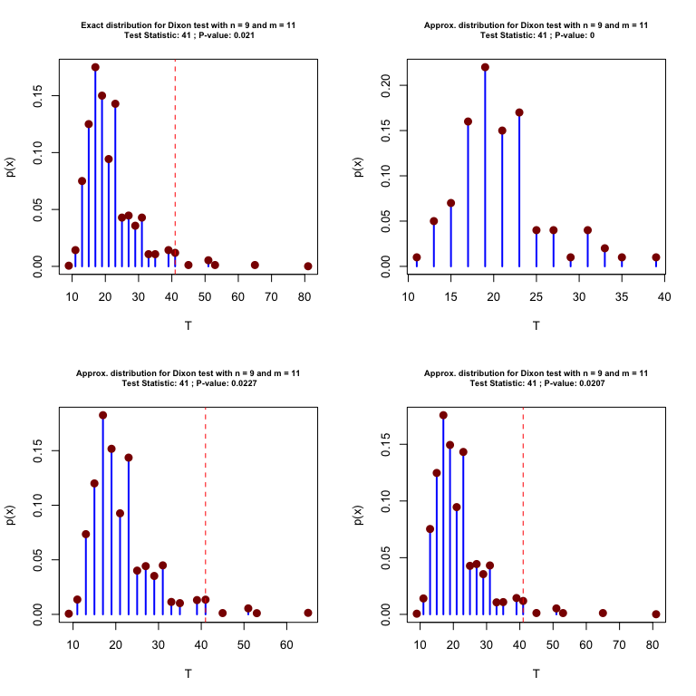
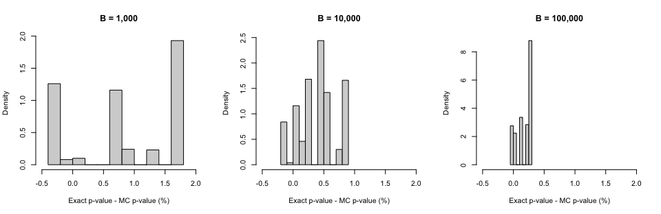

[](https://travis-ci.org/SMAC-Group/TwoCircles)
[](http://www.repostatus.org/#active)
[](https://www.gnu.org/licenses/gpl-3.0.en.html)
[](https://cran.r-project.org/)
[](https://cran.r-project.org/package=TwoCircles)
[](commits/develop)
[](/commits/master)

# `TwoCircles` Overview

This package implements various nonparametric methods for testing
whether two circular samples come from the same population and allows to
obtain its associated small-sample distribution. In particular, the
following test are considered:

  - `dixon`: for Dixon test,
  - `rao`: for Rao test,
  - `wilcox`: for Wilcoxon test,
  - `ww` for Wheeler-Watson test.

The code below presents a simple example with the pigeons dataset of
Schmidt-Koenig (1958).

``` r
# Load dataset
data(pigeons)

# Dixon test (exact pvalue)
circular_test(pigeons$control, pigeons$experimental)
#> 
#>       Dixon Two Sample Test
#> 
#> Data:  pigeons$control and pigeons$experimental
#> Test Statistic: 82
#> Exact P-value: 0.00185
#> Bracketing Points and Pair of Signif. Levels:
#> c1 = 44 (p1 = 0.0537)
#> c2 = 46 (p2 = 0.0479)

# Dixon test (approximated pvalue)
circular_test(pigeons$control, pigeons$experimental, type = "mc")
#> 
#>       Dixon Two Sample Test
#> 
#> Data:  pigeons$control and pigeons$experimental
#> Test Statistic: 82
#> Approx. P-value: 0.0027
#> P-value stand. error: 0.0001731
#> based on 10000 Monte-Carlo replications
```

It is also possible to compare the exact distribution of the test
statistic under \(H_0\) to the one obtained by simulations. This can be
done as follows:

``` r
par(mfrow = c(1,2))
plot(circular_test(pigeons$control, pigeons$experimental), cex.main = 0.7)
plot(circular_test(pigeons$control, pigeons$experimental, type = "mc", B = 10^3), cex.main = 0.7)
```



The simulation-based approach is proposed here as an alternative to
reduce the computational burden of then method when the samples are too
large to allow for the calculation of the exact sampling distribution
through exhaustive enumeration of all possible combinations. When the
number of Monte-Carlo replication is relatively large (say around
\(10^3\) or more) the results with the exact and approximated method are
very close. In addition, this method also provides an estimate of the
standard error associated to the obtained p-value, which is computed by
nonparametric bootstrap. The precision of the simulation-based approach
is illustrated in the simple simulation presented below where we
compared the p-values obtained with the exact and simulation-based
method.

``` r
# Number of simulations
B = 500

# Initialisation
exact_pval = rep(NA, B)
mc_pval = matrix(NA, B, 3)

for (i in 1:B){
  # Simulate samples
  set.seed(i)
  X = runif(8, 0, 360)
  Y = runif(7, 0, 360)
  
  # Compute exact pvalue
  exact_results = circular_test(X, Y)
  exact_pval[i] = mean(exact_results$stat <= exact_results$cv$dist)
  
  # Compute MC pvalue
  mc_results = circular_test(X, Y, type = "mc", B = 1000)
  mc_pval[i,1] = (1 + sum(mc_results$stat <= mc_results$mc$dist))/(length(mc_results$mc$dist) + 1)
  mc_results = circular_test(X, Y, type = "mc", B = 10000)
  mc_pval[i,2] = (1 + sum(mc_results$stat <= mc_results$mc$dist))/(length(mc_results$mc$dist) + 1)
  mc_results = circular_test(X, Y, type = "mc", B = 100000)
  mc_pval[i,3] = (1 + sum(mc_results$stat <= mc_results$mc$dist))/(length(mc_results$mc$dist) + 1)
}
```

The difference between the p-values obtained from the two methods are
presented in the histograms below:

``` r
par(mfrow = c(1,3))
hist(100*(exact_pval-mc_pval[,1]), col = "lightgrey", probability = TRUE, xlab = "Exact p-value - MC p-value (%)", main = "B = 1,000", xlim = c(-0.5, 2))

hist(100*(exact_pval-mc_pval[,2]), col = "lightgrey", probability = TRUE, xlab = "Exact p-value - MC p-value (%)", main = "B = 10,000", xlim = c(-0.5, 2))

hist(100*(exact_pval-mc_pval[,3]), col = "lightgrey", probability = TRUE, xlab = "Exact p-value - MC p-value (%)", main = "B = 100,000", xlim = c(-0.5, 2))
```



## Install Instructions

To install the `TwoCircles` package, there is currently one option:
[GitHub](https://github.com/SMAC-Group/TwoCircles/).

``` r
# Install dependencies
install.packages(c("circular", "devtools"))

# Install the package from GitHub
devtools::install_github("SMAC-Group/TwoCircles")
```
